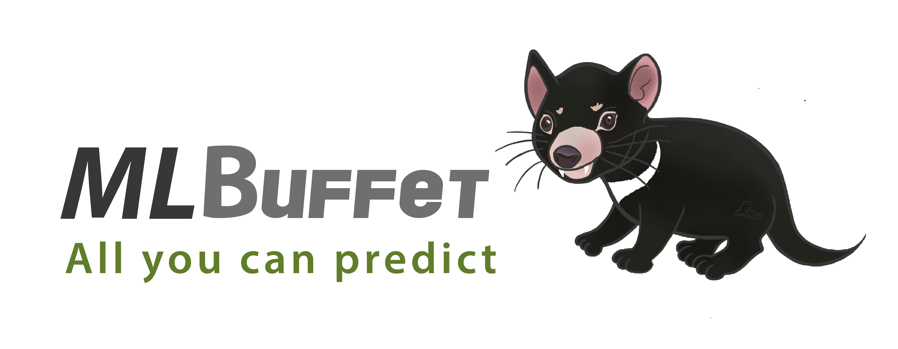

# MLBuffet

----

This project is a Machine Learning Model Server based on containers. MLBuffet consists of several modules described in the table below:

| Module    | Description                                                                                                                                                                                                                                                                                     |
|-----------|-------------------------------------------------------------------------------------------------------------------------------------------------------------------------------------------------------------------------------------------------------------------------------------------------|
| Deploy    | Contains the necessary files to deploy the project, in docker-compose, Docker Swarm or Kubernetes.                                                                                                                                                                                                                 |
| Inferrer  | REST API that receives HTTP requests and balances the workload between Modelhosts.                                                                                                                                                                                                                     |
| Modelhost | Workers for model deployment, inference and model management. There should be multiple instances of this module, each being aware of all the models stored. |
| Metrics   | Gathers and manages performance metrics from host system and services.                                                                                                                                                                                                                          |
| Storage  | Performs version controlling.                                                                                                                                                                                                                          |

If you are new to MLBuffet, please take a look at MLBuffet in a nutshell [document](docs/nutshell.md)

# Service description

The Inferrer and Modelhost modules expose REST APIs built on Flask for intercommunication. The Inferrer will handle user
requests made to the available models, i.e., uploading a model, asking for a prediction... And will send them as jobs to
any of the Modelhosts, which will perform them in the background asynchronously.

When a prediction is requested, the Modelhost will pass the HTTP request as an input to the ONNX session running in the background, and the answer is sent
back to the user through Inferrer.

----

# Quickstart

## Build & Deploy the services

TCP ports 80, 8001, 8002 and 9091 must be available before deploying in Docker Swarm or docker-compose. For Kubernetes deployments, check the YAML files to configure port forwarding and exposing.

### Recommended build

Images must be built from source with the provided build.sh script.

For orchestrated deployments (Docker Swarm or Kubernetes), all images must be available for every
node on the cluster, otherwise nodes will not be able to deploy containers.

For **Docker Swarm** deployments, there is a deploy.sh script provided which will deploy automatically and configure your cluster. There are two restrictions:

- Stack name must be set as
 (this is a reserved name for container intracommunication).
- The mlbuffet_overlay network is used by nodes to communicate. The
preferred subnet is 10.0.13.0/24.

For **Kubernetes** deployments, there is also a script provided, deploy.sh, however all the config files are provided so the user can deploy with custom configuration if desired.


**Reported issue:** Sometimes after installing docker-compose, the docker-compose tool is unable to access the docker socket
due to permission issues. To solve
this problem, include docker your user in the docker group with `sudo usermod -aG docker $USER`. Then, give
docker-compose permission to access the docker.socket file, by running `sudo chmod 666 /var/run/docker.sock`.

## Test the API and welcome

The module for the user to communicate via HTTP requests is the Inferrer.

To test the API, use `curl http://localhost:8002/` in Docker Swarm or standalone deployments.

In Kubernetes, use `kubectl get endpoints inferrer` to check where the API is hosted.

The welcome message should be displayed.

```json
{
  "http_status": {
    "code": 200,
    "description": "Greetings from MLBuffet - Inferrer, the Machine Learning model server. For more information, visit /help",
    "name": "OK"
  }
}
```

Or you can try asking for some help:

`curl http://localhost:8002/help`


## Model Handling

Some pre-trained models are already uploaded and can be updated manually through the `probe_models/` directory.
However, new model uploading is supported by MLBuffet. All Modelhost servers can access the directory of models, so they
share a pool of common models.

Every model must be associated with a tag, which will always be located in the path.

For instance, we can have some versions of the iris model as `irisv1.onnx`, `irisv2.onnx` or `iris_final_version.onnx`, but all of them are several versions of the same model, tagged as `iris_model`.

You can upload new versions of a tag model, and they will be stored into the storage module of MLBuffet, only the default versions of each tag will be exposed into the path `modelhost/models/`.

In **Kubernetes** deployments, the volume for models is `/tmp`. You can change this directory for the models not being ephemeral in the pv.yaml file that is provided in the deploy directory.

Several methods for model handling can be used from the API:

**Get the list and descriptions of available models**

`curl -X GET http://localhost:8002/api/v1/models`

```json
{
  "http_status": {
    "code": 200,
    "description": "OK",
    "name": "OK"
  },
  "model_list": [
    {
      "description": "",
      "model": "diabetes.onnx"
    },
    {
      "description": "Clasificación de especies de flores de Iris. Se clasifican en setosa, versicolor o virginica dependiendo de las medidas de sépalo y pétalo",
      "model": "iris.onnx"
    }
  ]
}
```

**Get model information**

The specific information of any model can also be requested with GET /api/v1/models/<model_name> method:

`curl -X GET http://localhost:8002/api/v1/models/iris_model`

**Update model information**

A model may have incomplete information, wrong information or no information at all. You can update the description of a
model using POST method:

`curl -X POST -H "Content-Type: application/json" --data '{"model_description":"This model classifies a 4 element array input between different species of Iris flowers."}' http://localhost:8002/api/v1/models/iris_model`

**Upload a new model**

You can upload your own models to the server using PUT method:

`curl -X PUT -F "path=@/path/to/local/model" http://localhost:8002/api/v1/models/<tag>`

You can also give some information of the version changes:

`curl -X PUT -F "path=@/path/to/local/model" -F "model_description=version description of the file" http://localhost:8002/api/v1/models/<tag>`

> This description will not be able to changes, and will not be read with the modelhost service.

When a new version is uploaded, that will be associated as the default model, and read by the modelhosts.

**Get tag information**

You can read the relevant information of the models associated with a tag:

`curl -X GET http://localhost:8002/api/v1/models/iris_model/information`

```json
{
  "http_status": {
    "code": 200,
    "description": "OK",
    "name": "OK"
  },
  "tag_list_versions": {
    "1": {
      "description": "Not description provided",
      "file": "iris.onnx",
      "folder": "files/iris_model/1",
      "time": "11:05:06 25/03/2022"
    },
    "2": {
      "description": "second version",
      "file": "iris_v2.onnx",
      "folder": "files/iris_model/2",
      "time": "11:21:23 25/03/2022"
    }
  }
}

```

**Delete a model**

Delete models you do not need anymore with DELETE method. You can specify the version you want remove of the storage in
three ways:

* `<tag>`
* `<tag>:default`
* `<tag>:<version>`

The first two methods remove the file set as default, and the last one removes the specified version.

`curl -X DELETE http://localhost:8002/api/v1/models/<tag>`

**Set model as default**

You can put any version stored into the storage service as the default version:

`curl -X POST -H "Content-Type: application/json" --data '{"default": <new default version>}'
http://localhost:8002/api/v1/models/<tag>/default`

**Download version**

You can download any version of any tag located into the storage module.
You can specify the version you want give from the storage in three ways:

* `<tag>`
* `<tag>:default`
* `<tag>:<version>`

The first two methods download the file set as default, and the last one downloads the specified version.

`wget http://localhost:8002/api/v1/models/<tag>/download --content-disposition`

You can also download files with your browser with the above URL.

## Model Predictions

**Get a prediction!**

Once models have been correctly uploaded, the server is ready for inference. Requests must be done with an input in json format. This command will send an HTTP request to the server asking for a prediction on the pre-uploaded Iris model:

`curl -X POST -H "Content-Type: application/json" --data '{"values":[2, 5, 1, 4]}' http://localhost:8002/api/v1/models/iris.onnx/prediction`

```json
{
  "http_status": {
    "code": 200,
    "description": "Prediction successful",
    "name": "OK"
  },
  "values": [
    1
  ]
}

```

The field "values":[1] is the prediction for the input flower. You are now ready to upload your own models and make
predictions!

You can predict objects with more complex models. For now, the server only is enabled to predict with images, but other
types could be allowed in the future. For that predictions, the command to send the HTTP request is the following:

`curl -X GET -F "file=@dog_resized.jpeg" http://localhost:8002/api/v1/models/dog_model.onnx/prediction | jq`

```json
{
  "http_status": {
    "code": 200,
    "description": "Prediction successful",
    "name": "OK"
  },
  "values": [
    [
      8.3947160334219e-09,
      ...
      2.68894262411834e-09
    ]
  ]
}
```

## Train your own models:

**Prepare your trining scripts**

MLBuffet is able to train your own models and automatically upload them for inference or model management.
For this capability to be available it is necessary to expose your Docker daemon in the Docker host's machine
at port :2376, and security is enforced by TLS by default. This settings might not be changed to --unsecure,
as exposing your docker daemon insecurely is a high risk practice and can lead to security issues.
Your client cert, key and ca-certs must be located at `inferrer/flask_app/utils/certs`.

MLBuffet supports training using any Python-based library, but some interaction and configuration is required from the
user. You will need 3 files to perform training on a virtualized container environment, which are your custom
`train.py` script, `requirements.txt` with all the libraries and tools to be imported during training, and `dataset.csv`
or any other data file which must be read during runtime by the training script to make operations over the dataset and
perform the training.

The way MLBuffet knows which file that has been uploaded corresponds to each of the above is via form names. "script" is
for the training script, "requirements" for `requirements.txt` and "dataset" for the dataset.

The output models will be sent to a local directory via a Docker bind mount volume. You can make this directory coincide
with the Modelhost mounting point for the models to be trained also being used for inference, if trained with ONNX
supported format.

Example `curl` request:

```curl -X POST localhost:8002/api/v1/train/<tag>/<model_name> -F "dataset=@/path/to/dataset.csv" -F "script=@/path/to/train.py" -F "requirements=@/path/to/requirements.txt"```

Take into account that these code will be executed inside a containerized environment and the resulting model must be
able to be located by the Trainer container to auto-upload it into the system. The tag associated to the model must be
provided in `<tag>`. The model name must be the same that you sed in the HTTP request `<model_name>`.
