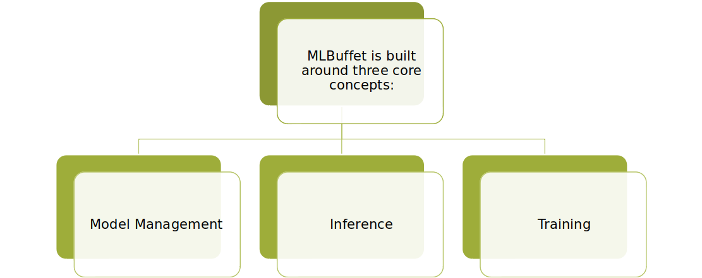

# MLBuffet In a nutshell

## What is it
MLBuffet is an Open-Source tool focused on Machine-Learning projects that require to be performed on the Edge.

## What is it able to do

MLBuffet brinsg ML processes to Edge containers.

* Perform inference on ONNX models.
* Train models in ANY Python based ML library.
* Manage and Store models.
* Version controlling models.

## What problems does it solve

MLBuffet can solve several problems, but sometimes is not necessary deploy it:

#### Use MLBuffet if you...

+ Need or prefer a containerized solution  
+ Need Edge training/re-training of models 
+ Run inference on ONNX models             
+ Deploy multiple models                   
+ Need model management on de Edge         
+ Are not Cloud dependent                  
+ Need fast responses from simple models   
+ Perform many model requests per second   
+ Require decentralization (clustering)    

#### Don't use MLBuffet if you...

- Can't run containers
- Heavily rely on Cloud for training
- Need video processing
- Do inference on models once in a while
- Need a centralized solution
- Don't require orchestration

